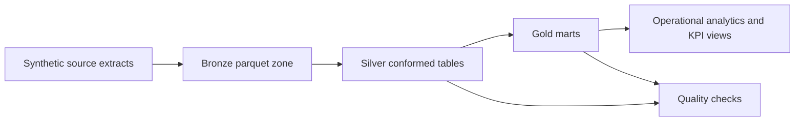

# Clinical Trial Lakehouse Observatory

An original, local-first data engineering project that demonstrates how to model a regulated clinical-trial analytics platform using synthetic source data and a medallion-style lakehouse.

## Why this project exists

This repo is designed to publicly demonstrate skills in:

- governed data platform design
- bronze, silver, and gold data modeling
- PySpark-style data engineering translated into a reproducible local pipeline
- data quality enforcement
- analytics-ready marts for operations and BI

## Architecture



## Data domains

- `participants`: enrolled trial participants by site and study
- `visits`: patient visit activity and completion status
- `labs`: common biomarker measurements recorded at visits
- `adverse_events`: patient safety events with severity and outcome

## Gold outputs

- `gold_enrollment_site_summary`
- `gold_patient_risk_monitor`
- `gold_study_kpis`

## Quick start

```bash
cd project-blueprints/clinical-trial-lakehouse-observatory
python3 scripts/run_pipeline.py
python3 scripts/query_gold.py
pytest
```

## Repo layout

```text
clinical-trial-lakehouse-observatory/
├── docs/
├── scripts/
├── src/ctlo/
├── tests/
├── data/raw/
└── warehouse/
```

## Notes

- All source data is synthetic.
- The project uses DuckDB and Parquet to keep the local experience lightweight while still feeling lakehouse-like.
- The structure intentionally mirrors production thinking: separate ingest, transform, quality, and serving layers.
